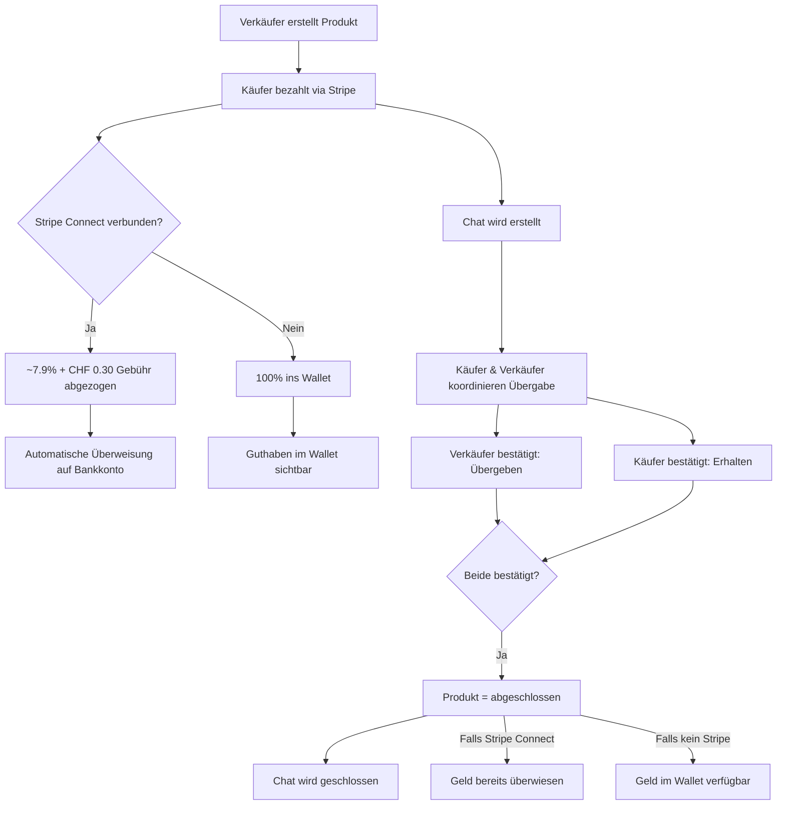

# 🎒 StudyBuy

[](https://laravel.com)
[](https://php.net)
[](https://stripe.com)
[](LICENSE)

> **Marktplatz für studienrelevante Second-Hand-Objekte**
> Von Studis für Studis – einfach, sicher und nachhaltig

## 📖 Über StudyBuy

StudyBuy ist ein spezialisierter Re-Commerce-Marktplatz für Studierende an Universitäten und Fachhochschulen. Die Plattform ermöglicht den einfachen, sicheren und lokalen Handel von studienrelevanten Objekten wie:

- 💻 **Elektronik** (iPads, Laptops, Tablets)
- 📚 **Fachbücher** und Lehrmaterial
- 🖩 **Taschenrechner** (TI-84, Casio, etc.)
- 🎒 **Zubehör** (Rucksäcke, Schreibwaren, etc.)

### 🎯 Vision & Mission

**Vision:** Der führende Marktplatz für studentische Second-Hand-Objekte im DACH-Raum zu werden.

**Mission:**
- 🌱 **Nachhaltigkeit**: Wiederverwendung statt Neukauf – Reduktion von Ressourcenverbrauch und CO₂-Fussabdruck
- 💰 **Erschwinglichkeit**: Zugang zu günstigen Studienmaterialien für alle
- 🤝 **Gemeinschaft**: Eine vertrauenswürdige Community durch Verified-Student-Registrierung
- ❤️ **Soziale Verantwortung**: Unterstützung bedürftiger Studierender durch einen Studentenfonds

---

## ✨ Features

### 🔐 Verified Student System
- Registrierung mit universitärer E-Mail-Adresse
- E-Mail-Verifizierung erforderlich
- Erhöhte Sicherheit und Vertrauen innerhalb der Community
- Zugang nur für verifizierte Studierende

### 🛍️ Marktplatz-Funktionen
- **Produktinserate** mit bis zu 5 Bildern
- **Kategorisierung** nach Produkttypen (Elektronik, Bücher, etc.)
- **Schulen/Universitäten** Filter für lokale Angebote
- **Suchfunktion** mit Filter-Optionen
- **Produktdetailseiten** mit Forum für Fragen
- **Produktforum** - Nutzer können öffentliche Fragen zum Produkt stellen

### 💳 Zahlungsabwicklung (Stripe)
- **Sichere Zahlungen** über Stripe Checkout
- **Stripe Connect** Integration für automatische Auszahlungen
- **In-App Wallet** für Verkäufer ohne Stripe Connect
- **Transaktionsstatus-Tracking** (übergeben/erhalten/abgeschlossen)
- **Automatischer Chat** zwischen Käufer und Verkäufer nach Kauf

### 💰 Auszahlungssystem

#### Option 1: Stripe Connect (Automatisch) - ~7.9% + CHF 0.30 Gebühr
- **Gebührenstruktur:**
  - 5% Plattformgebühr (StudyBuy)
  - 2.9% + CHF 0.30 Zahlungsabwicklung (Stripe)
  - **Total: ~7.9% + CHF 0.30**
- Automatische Auszahlung direkt auf Bankkonto
- Sofortige Überweisung nach Transaktionsabschluss
- Vollautomatisch
- **Beispiel:** CHF 100 Verkauf → Verkäufer erhält ~CHF 92.00

#### Option 2: In-App Wallet + IBAN-Auszahlung - 8% + CHF 5.00
- Verkäufe landen zu 100% im Wallet (kein Abzug beim Verkauf!)
- Manuelle Auszahlungsanfrage per IBAN
- Gebühren fallen nur bei Auszahlung an: 8% + CHF 5.00
- Bearbeitungszeit: 2-5 Werktage
- Admin-Bearbeitung erforderlich
- **Beispiel:** CHF 100 Auszahlung → Verkäufer erhält CHF 87.00

### 💬 Chat-System
- **Automatische Chat-Erstellung** nach erfolgreichem Kauf
- **Echtzeit-Kommunikation** zwischen Käufer und Verkäufer
- **Produktübergabe koordinieren**
- **Status-Updates** direkt im Chat
- Chat wird geschlossen, sobald Transaktion abgeschlossen ist

### 📦 Meine Produkte
- **Verkäufe** - Übersicht aller verkauften Produkte
- **Käufe** - Übersicht aller gekauften Produkte
- **Status-Buttons**: "Übergeben" & "Erhalten"
- **Automatischer Abschluss** wenn beide Parteien bestätigt haben

### 👨‍💼 Admin-Bereich
- Dashboard mit Übersicht und Statistiken
- Verwaltung von Kategorien
- Verwaltung von Schulen/Universitäten
- E-Mail-Log-Verwaltung
- Benutzerverwaltung mit Admin-Rollen
- **Auszahlungsanfragen-Management** (in Entwicklung)

---

## 🔄 Prozesse & Workflows

### 1️⃣ Verkaufsprozess



### 2️⃣ Zahlungsfluss - MIT Stripe Connect

**Beispiel: Produkt für CHF 100**

1. **Käufer bezahlt**: CHF 100 via Stripe
2. **Plattform erhält**: CHF 100 (sofort)
3. **Bei Abschluss**:
   - Plattform-Gebühr: 5% = CHF 5.00
   - Stripe-Gebühr: 2.9% + CHF 0.30 = CHF 3.20
   - **Total Gebühren**: CHF 8.20 (~8.2%)
   - **Verkäufer erhält**: CHF 91.80 (automatisch auf Bankkonto)

**Gebührenaufschlüsselung:**
- StudyBuy behält: CHF 5.00 (Plattformgebühr)
- Stripe behält: CHF 3.20 (Zahlungsabwicklung)
- An Verkäufer: CHF 91.80 (via Stripe Transfer)

**Zeitlinie:**
- Zahlung → Sofort
- Auszahlung → Nach Bestätigung (übergeben + erhalten)
- Bankkonto → 1-2 Werktage

### 3️⃣ Zahlungsfluss - OHNE Stripe Connect (Wallet)

**Beispiel: Produkt für CHF 100**

1. **Käufer bezahlt**: CHF 100 via Stripe
2. **Plattform erhält**: CHF 100 (sofort)
   - Stripe-Gebühr (2.9% + CHF 0.30 = CHF 3.20) wird von der Plattform getragen
3. **Bei Abschluss**:
   - **Wallet wird gutgeschrieben**: CHF 100.00 (kein Abzug!)
4. **Bei IBAN-Auszahlung**:
   - Verkäufer beantragt Auszahlung
   - Gebühr: 8% + CHF 5.00 = CHF 13.00
   - **Verkäufer erhält**: CHF 90.00 (manuell überwiesen)
   - **Plattform behält**: CHF 10.00

**Gebührenaufschlüsselung:**
- Stripe-Gebühr beim Kauf: CHF 3.20 (trägt die Plattform)
- StudyBuy behält bei Auszahlung: CHF 13.00 (8% + CHF 5.00)
- **Netto-Gewinn für Plattform**: CHF 6.80 pro CHF 100 Verkauf

**Zeitlinie:**
- Zahlung → Sofort
- Wallet-Gutschrift → Nach Bestätigung (übergeben + erhalten)
- Auszahlungsanfrage → Jederzeit möglich (Minimum: CHF 10)
- Banküberweisung → 2-5 Werktage nach Admin-Bearbeitung

### 4️⃣ Transaktionsstatus-Workflow

```
Kauf abgeschlossen
    ↓
[erhalten: false, uebergeben: false, abgeschlossen: false]
    ↓
Verkäufer klickt "Übergeben"
    ↓
[erhalten: false, uebergeben: true, abgeschlossen: false]
    ↓
Käufer klickt "Erhalten"
    ↓
[erhalten: true, uebergeben: true, abgeschlossen: true]
    ↓
✅ TRIGGER: Automatische Auszahlung
    ├─ Stripe Connect → Direkt auf Bankkonto
    └─ Kein Stripe → Ins Wallet
```

### 5️⃣ Wallet-Transaktionen

**Typen:**
- `credit` - Geld kommt rein (Verkauf abgeschlossen)
- `debit` - Geld geht raus (Auszahlungsanfrage)

**Tracking:**
- Jede Transaktion wird mit Beschreibung gespeichert
- Balance nach jeder Transaktion wird protokolliert
- Referenz zu Product oder PayoutRequest

---

## 🛠️ Technologie-Stack

### Backend
- **Framework**: Laravel 11.x
- **PHP**: 8.2+
- **Datenbank**: MySQL
- **Authentication**: Laravel Breeze
- **Payments**: Stripe API & Stripe Connect

### Frontend
- **Views**: Blade Templates
- **Styling**: Inline CSS (MVP-Phase)
- **JavaScript**: Alpine.js (minimal)
- **Icons**: SVG Icons

### Services
- **Stripe**: Zahlungen, Checkout, Connect
- **Email**: SMTP (Hostpoint)
- **Storage**: Local File Storage

---

## 📁 Projektstruktur

```
studybuy/
├── app/
│   ├── Http/
│   │   ├── Controllers/
│   │   │   ├── Admin/
│   │   │   │   ├── CategoryController.php
│   │   │   │   ├── DashboardController.php
│   │   │   │   ├── EmailLogController.php
│   │   │   │   └── SchoolController.php
│   │   │   ├── ChatController.php            # Chat-Verwaltung
│   │   │   ├── MyProductsController.php      # Verkäufe/Käufe + Status-Updates
│   │   │   ├── ProductController.php         # Produkt-CRUD + Checkout
│   │   │   ├── StripeConnectController.php   # Stripe Connect Onboarding
│   │   │   ├── WalletController.php          # Wallet + Auszahlungen
│   │   │   └── ProfileController.php
│   │   ├── Middleware/
│   │   │   └── IsAdmin.php
│   └── Models/
│       ├── Chat.php
│       ├── ChatMessage.php
│       ├── PayoutRequest.php                 # IBAN-Auszahlungsanfragen
│       ├── Product.php
│       ├── ProductCategory.php
│       ├── ProductForumMessage.php
│       ├── ProductImage.php
│       ├── School.php
│       ├── User.php
│       ├── Wallet.php                        # User Wallet
│       └── WalletTransaction.php             # Transaktionshistorie
├── database/
│   ├── migrations/
│   │   ├── 2025_11_20_*_create_stripe_payment_logs_table.php
│   │   ├── 2025_12_01_*_add_status_columns_to_products_table.php
│   │   ├── 2025_12_03_*_add_stripe_connect_to_users_table.php
│   │   ├── 2025_12_03_*_create_wallets_table.php
│   │   ├── 2025_12_03_*_create_payout_requests_table.php
│   │   └── 2025_12_03_*_create_wallet_transactions_table.php
│   └── seeders/
│       └── ProductCategorySeeder.php
├── resources/
│   └── views/
│       ├── admin/
│       ├── auth/
│       ├── chats/                            # Chat-Views
│       ├── my-products/                      # Verkäufe/Käufe
│       ├── products/
│       │   ├── checkout-success.blade.php
│       │   ├── checkout-cancel.blade.php
│       │   └── show.blade.php
│       ├── profile/
│       │   └── partials/
│       │       ├── stripe-connect-section.blade.php
│       │       └── wallet-section.blade.php
│       └── dashboard.blade.php
└── .env
```

---

## 🗄️ Datenbank-Schema

### Kern-Tabellen

#### **users**
```sql
- id
- name
- email
- password
- bit (Admin-Flag)
- stripe_connect_id (Stripe Account ID)
- stripe_connect_enabled (Boolean)
- stripe_connect_created_at
- email_verified_at
- timestamps
```

#### **products**
```sql
- id
- user_id (Verkäufer)
- buyer_id (Käufer, nullable)
- school_id
- product_category_id
- title
- description
- price
- sold_at
- expires_at
- is_active
- erhalten (Boolean)
- uebergeben (Boolean)
- abgeschlossen (Boolean)
- timestamps
- deleted_at (SoftDeletes)
```

#### **wallets**
```sql
- id
- user_id (unique)
- balance (Decimal 10,2)
- currency (Default: CHF)
- timestamps
```

#### **wallet_transactions**
```sql
- id
- wallet_id
- user_id
- type (credit/debit)
- amount (Decimal 10,2)
- balance_after (Decimal 10,2)
- description
- reference_type (Product, PayoutRequest)
- reference_id
- timestamps
```

#### **payout_requests**
```sql
- id
- user_id
- amount (Decimal 10,2)
- fee_amount (Decimal 10,2)
- net_amount (Decimal 10,2)
- iban
- account_holder_name
- status (pending/processing/completed/rejected)
- admin_notes
- processed_at
- processed_by (Admin User ID)
- timestamps
```

#### **chats**
```sql
- id
- product_id
- user1_id
- user2_id
- last_message_at
- timestamps
```

#### **chat_messages**
```sql
- id
- chat_id
- user_id
- message
- is_read
- timestamps
```

---

## ⚙️ Konfiguration (.env)

### Stripe
```env
STRIPE_KEY=pk_test_...                    # Publishable Key
STRIPE_SECRET=sk_test_...                 # Secret Key
STRIPE_WEBHOOK_SECRET=whsec_...           # Webhook Secret
```

### Gebühren
```env
# Stripe Connect (automatische Auszahlung)
PLATFORM_FEE_PERCENTAGE=5                 # 5% Gebühr

# Manuelle IBAN-Auszahlung
MANUAL_PAYOUT_FEE_PERCENTAGE=8            # 8% Prozent-Gebühr
MANUAL_PAYOUT_FIXED_FEE=5.00              # CHF 5.00 Fixgebühr
```

### E-Mail
```env
MAIL_MAILER=smtp
MAIL_HOST=asmtp.mail.hostpoint.ch
MAIL_PORT=587
MAIL_USERNAME=info@studybuy.ch
MAIL_ENCRYPTION=tls
MAIL_FROM_ADDRESS=info@studybuy.ch
MAIL_FROM_NAME="StudyBuy"
```

---

## 🎨 Design-Prinzipien

### Farbschema
- **Primary**: `#1aa8ba` (Türkis) - CTAs, Links
- **Success**: `#28a745` (Grün) - Stripe Connect aktiv
- **Danger**: `#dc3545` (Rot) - IBAN-Gebühren, Warnungen
- **Background**: `#f8f9fa` (Hellgrau)
- **Cards**: `#ffffff` (Weiß)
- **Text**: `#000000`, `#333333`, `#666666`

### UI/UX Philosophie
- **Minimalistisch**: Fokus auf Inhalte
- **Transparent**: Alle Gebühren klar kommuniziert
- **Studentenfreundlich**: Einfache, intuitive Navigation
- **Mobile First**: Responsive Design
- **Schnell**: Optimierte Ladezeiten

---

## 🔑 Berechtigungen & Rollen

### Benutzer-Typen

1. **Gast**
   - Produkte durchsuchen
   - Produktdetails ansehen

2. **Registrierter User** (verifiziert)
   - Produkte kaufen
   - Produkte verkaufen
   - Chat nutzen
   - Wallet verwalten
   - Stripe Connect verbinden

3. **Admin** (`bit = true`)
   - Alle User-Funktionen
   - Kategorie-Management
   - Schulen-Management
   - E-Mail-Logs ansehen
   - Auszahlungsanfragen bearbeiten (in Entwicklung)

---

## 📊 Gebührenstruktur

### Vergleich

| Methode | Gebühr | Auszahlung | Geschwindigkeit |
|---------|--------|------------|-----------------|
| **Stripe Connect** | 5% | Automatisch | Sofort nach Abschluss |
| **IBAN (Wallet)** | 8% + CHF 5.00 | Manuell | 2-5 Werktage |

### Kostenbeispiel (CHF 100 Verkauf)

**Mit Stripe Connect:**
- Verkaufspreis: CHF 100
- Plattform-Gebühr: -CHF 5 (5%)
- Stripe-Gebühr: ~CHF 3 (zahlt Plattform)
- **Verkäufer erhält**: CHF 92 (automatisch)

**Ohne Stripe Connect:**
- Verkaufspreis: CHF 100
- Ins Wallet: +CHF 100 (voller Betrag!)
- Bei Auszahlung: -CHF 12 (8% + CHF 5)
- **Verkäufer erhält**: CHF 87 (manuell)

---

## 🚀 Installation & Setup

### Voraussetzungen
- PHP 8.2+
- Composer
- MySQL
- Node.js & NPM (für Assets)
- Stripe Account (Test & Live)

### Schritte

1. **Repository klonen**
```bash
git clone https://github.com/mariob06/studybuy.git
cd studybuy
```

2. **Dependencies installieren**
```bash
composer install
npm install
```

3. **Environment konfigurieren**
```bash
cp .env.example .env
php artisan key:generate
```

4. **Datenbank einrichten**
```bash
php artisan migrate --seed
```

5. **Storage Link erstellen**
```bash
php artisan storage:link
```

6. **Assets kompilieren**
```bash
npm run build
```

7. **Server starten**
```bash
php artisan serve
```

---

## 📧 Kontakt

- **Email**: info@studybuy.ch
- **Website**: [studybuy.ch](https://studybuy.ch)
- **GitHub**: [@mariob06/studybuy](https://github.com/mariob06/studybuy)

---

## 📝 Lizenz

MIT License - siehe [LICENSE](LICENSE) Datei

---

## 🔮 Roadmap

### ✅ Abgeschlossen
- [x] Benutzer-Authentifizierung
- [x] Produktverwaltung
- [x] Stripe Checkout Integration
- [x] Stripe Connect Integration
- [x] Wallet-System
- [x] Chat-System
- [x] Transaktionsstatus-Tracking
- [x] IBAN-Auszahlungsanfragen

### 🚧 In Entwicklung
- [ ] Admin-Panel für Auszahlungsbearbeitung
- [ ] E-Mail-Benachrichtigungen bei Verkäufen
- [ ] Bewertungssystem
- [ ] Produktempfehlungen

### 📋 Geplant
- [ ] Mobile App (iOS/Android)
- [ ] Push-Benachrichtigungen
- [ ] Favoriten/Merkliste
- [ ] Verkäufer-Profile mit Bewertungen

---

**Hinweis**: Dies ist ein aktiv entwickeltes Projekt. Features und Prozesse können sich ändern.

**Version**: 2.0.0 (Dezember 2024)
